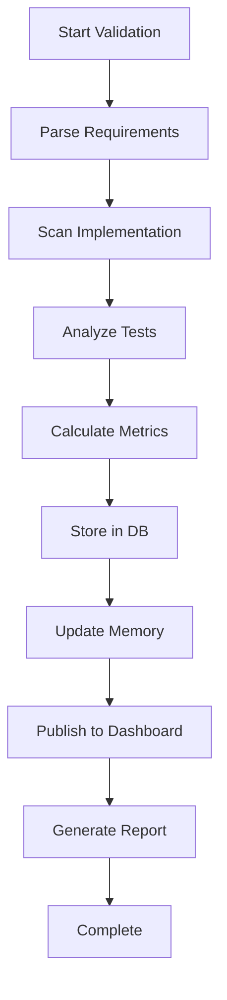

# Requirements Tracker Agent

## Agent Metadata
```yaml
name: requirements-tracker
type: autonomous
priority: high
schedule: "*/15 * * * *"  # Every 15 minutes
triggers:
  - on_code_change
  - on_commit
  - on_command: "/optimize requirements"
```

## Purpose
Continuously monitor and validate implementation against requirements, collecting metrics and maintaining compliance status.

## Responsibilities
1. **Requirement Parsing**: Extract requirements from functional-requirements.md
2. **Implementation Scanning**: Find requirement references in code
3. **Test Coverage Analysis**: Map tests to requirements
4. **Metrics Collection**: Calculate KPIs and send to dashboard
5. **Memory Updates**: Store important findings in Memory Service
6. **Report Generation**: Create compliance reports

## Tools & Capabilities
- File system access (read-only for source, write for reports)
- SQLite database for tracking
- Redis pub/sub for metrics
- Memory Service API access
- Git integration for change detection

## Communication Protocol

### Input Messages
```json
{
  "type": "validate_requirements",
  "project": "project-name",
  "branch": "feature/xyz",
  "trigger": "commit|manual|scheduled"
}
```

### Output Messages
```json
{
  "type": "requirements_status",
  "project": "project-name",
  "metrics": {
    "total": 50,
    "implemented": 35,
    "tested": 30,
    "coverage": 70
  },
  "critical_gaps": [],
  "report_url": "http://localhost:8080/reports/latest"
}
```

## Workflow



## Integration Points
- **Message Broker**: Subscribe to `requirements:validate` channel
- **Dashboard**: Publish to `metrics:requirements` channel
- **Memory Service**: Store patterns and decisions
- **Git Hooks**: Trigger on pre-commit/post-commit

## Autonomous Behaviors
1. **Auto-discovery**: Find new requirement files automatically
2. **Pattern Learning**: Store successful implementation patterns
3. **Recommendation Engine**: Suggest next requirements to implement
4. **Alert System**: Notify on critical requirement violations

## Configuration
```python
config = {
    "scan_interval": 900,  # 15 minutes
    "priority_weights": {
        "critical": 1.0,
        "high": 0.7,
        "medium": 0.4,
        "low": 0.2
    },
    "coverage_thresholds": {
        "minimum": 60,
        "target": 80,
        "excellent": 95
    },
    "alert_channels": ["slack", "dashboard", "memory"]
}
```
